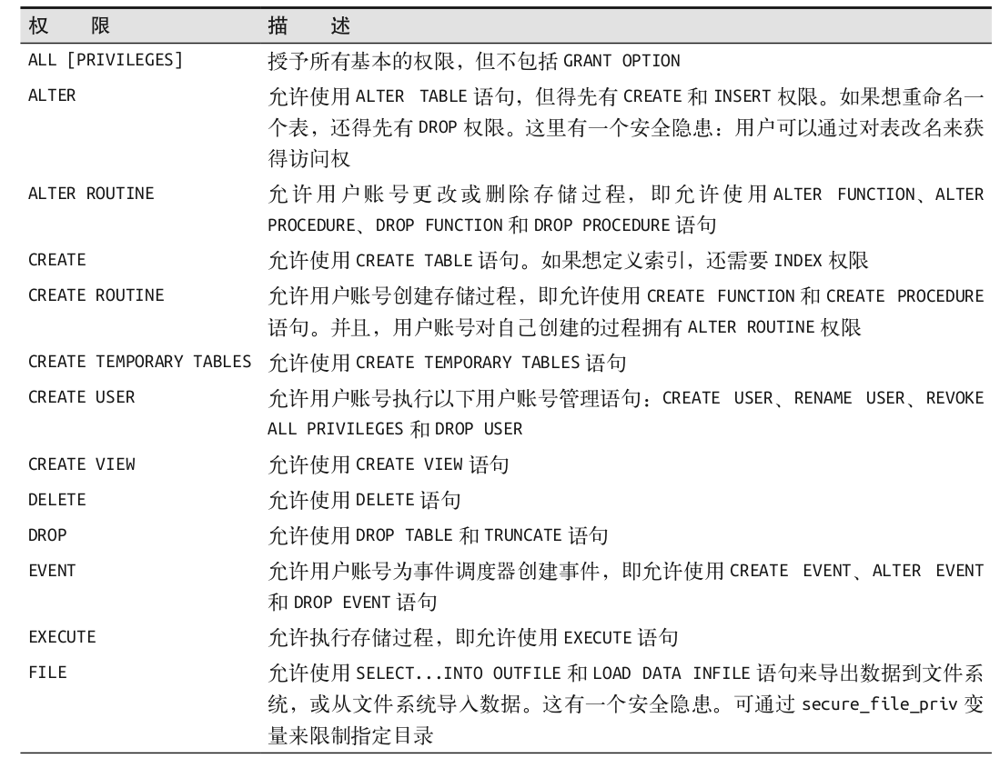
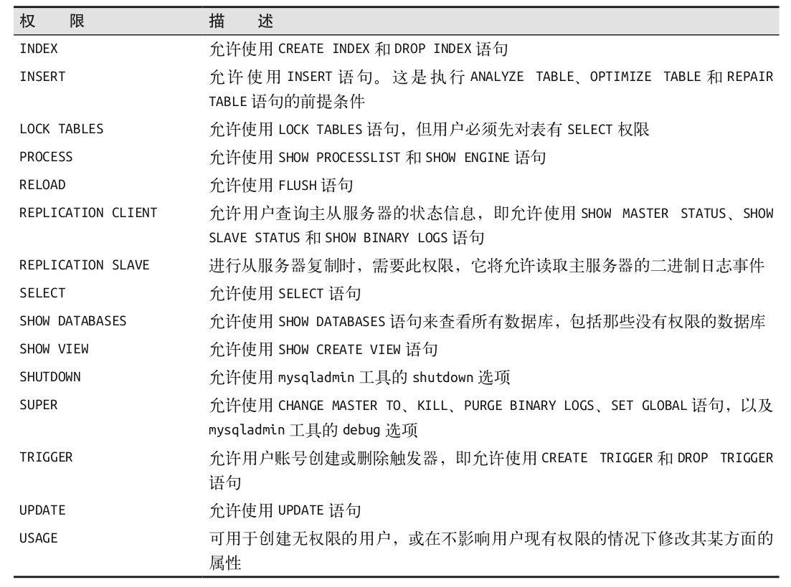

# 17 privileges

一个账号的命名，包含着地址。不同地址，相同名字的账号，是不同的，有着独立的权限。

使用 GRANT 授予 wow 增删改查的权限：

```
> GRANT INSERT, DELETE, UPDATE, SELECT ON test.* TO wow@'localhost';
```

授予权限不会删掉以前有的权限。

查看现有的权限（授予权限的语句）：

```
> SHOW GRANTS FROM wow \G
```

使用 REVOKE 回收 wow 的增删改权限：

```
> REVOKE INSERT, DELETE, UPDATE ON test.* FROM wow@'localhost';
```

## More

默认情况下，root账号可以授予权限，普通账号不行。

使用 GRANT OPTION 来给予用户这个权限，然后此账号可以把自身的权限授予其他的账号：

```
$ su -
# mysql
> GRANT ALL PRIVILEGES ON test.* TO wow@'localhost' WITH GRANT OPTION;
```

然后给予他创建账号和删除账号的权限：

```
> GRANT CREATE USER ON *.* TO wow@'localhost';
> GRANT SELECT ON mysql.* TO wow@'localhost';
```

## 可用权限


